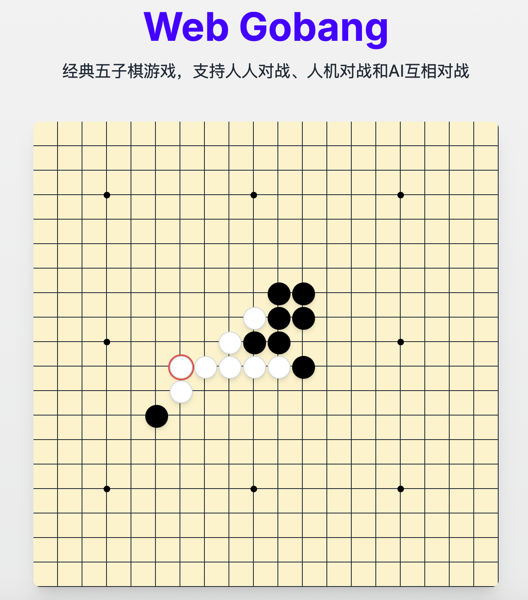

# Web Gobang - 在线五子棋游戏



一个现代化、功能丰富的在线五子棋（Gobang）游戏，支持人人对战、人机对战和AI之间的对战。

[在线试玩](https://your-username.github.io/Web_Gobang/) (部署后替换为实际链接)

## 特色功能

- 👥 **多种对战模式**：支持人人对战、人机对战和AI互相对战
- 🧠 **多AI提供商**：支持OpenAI、Anthropic、Deepseek、Qwen、Gemini等多家AI服务
- 🎮 **友好的界面**：美观的棋盘界面、实时游戏状态和历史记录
- 🛠️ **灵活的设置**：可自定义玩家ID、选择AI模型和配置API
- 🌐 **本地AI逻辑**：即使没有API密钥，也能与本地AI逻辑对战
- 🏆 **胜利庆祝**：有动画效果的胜利提示

## 技术栈

- Next.js 14 (App Router)
- React
- TypeScript
- Tailwind CSS
- DaisyUI

## 如何使用

### 1. 设置玩家

- **人类玩家**：选择"人类棋手"并设置您的棋手ID
- **AI玩家**：选择"AI棋手"，然后配置以下设置：
  - 选择AI提供商（OpenAI、Anthropic、Deepseek等）
  - 选择AI模型
  - 输入您的API密钥

### 2. 开始游戏

- 点击"开始游戏"按钮
- 黑方先行，玩家轮流落子
- 当一方在横、竖或斜线上形成连续五子时获胜

### 3. 游戏控制

- **重新开始**：重置棋盘，开始新游戏
- **返回设置**：回到游戏设置页面
- **AI对战模式**：可以选择手动控制每一步，或开启自动对弈模式

## 本地开发

1. 克隆仓库：

```bash
git clone https://github.com/your-username/Web_Gobang.git
cd Web_Gobang
```

2. 安装依赖：

```bash
npm install
```

3. 启动开发服务器：

```bash
npm run dev
```

4. 在浏览器中访问 `http://localhost:3000`

## 部署到GitHub Pages

要将此项目部署到GitHub Pages，请按照以下步骤操作：

1. 添加部署配置：

首先，在项目根目录下新建 `next.config.js` 文件（或更新现有文件）：

```javascript
/** @type {import('next').NextConfig} */
const nextConfig = {
  output: 'export',  // 启用静态导出
  basePath: process.env.NODE_ENV === 'production' ? '/Web_Gobang' : '',
  images: {
    unoptimized: true,
  },
  // 禁用API路由的静态生成
  experimental: {
    appDir: true,
  },
};

module.exports = nextConfig;
```

2. 添加部署工作流：

创建一个 `.github/workflows/deploy.yml` 文件：

```yaml
name: Deploy to GitHub Pages

on:
  push:
    branches: [ main ]
  workflow_dispatch:

permissions:
  contents: read
  pages: write
  id-token: write

jobs:
  build:
    runs-on: ubuntu-latest
    steps:
      - name: Checkout
        uses: actions/checkout@v3
      - name: Setup Node
        uses: actions/setup-node@v3
        with:
          node-version: "18"
          cache: 'npm'
      - name: Install dependencies
        run: npm ci
      - name: Build with Next.js
        run: npm run build
      - name: Upload artifact
        uses: actions/upload-pages-artifact@v2
        with:
          path: ./out

  deploy:
    environment:
      name: github-pages
      url: ${{ steps.deployment.outputs.page_url }}
    runs-on: ubuntu-latest
    needs: build
    steps:
      - name: Deploy to GitHub Pages
        id: deployment
        uses: actions/deploy-pages@v2
```

3. 在GitHub仓库设置中启用GitHub Pages：

   - 前往您的GitHub仓库
   - 点击 "Settings" 选项卡
   - 滚动到 "GitHub Pages" 部分
   - 在 "Source" 下拉菜单中选择 "GitHub Actions"

4. 推送代码到GitHub：

```bash
git add .
git commit -m "配置GitHub Pages部署"
git push
```

5. 等待GitHub Actions工作流完成，您的应用将被部署至：
   `https://your-username.github.io/Web_Gobang/`

## 静态部署注意事项

由于GitHub Pages是静态网站托管服务，有以下使用限制和解决方案：

1. **无API路由支持**：
   - GitHub Pages不支持服务器端API路由
   - 本项目会自动检测部署环境，在静态环境（GitHub Pages）中自动切换到客户端AI逻辑
   - 在本地开发环境中保持使用API路由与真实AI模型交互的能力

2. **客户端AI模式**：
   - 在GitHub Pages环境中，即使配置了API密钥和选择了AI模型，游戏也会使用内置的本地AI算法
   - 本地AI算法经过优化，实现了五子棋的核心策略，包括：
     - 胜利检测（连续五子判断）
     - 威胁检测（阻止对手连成五子）
     - 活三/活四形成和防御
     - 中心控制和棋型评估
   - 这确保了良好的游戏体验，即使没有真实AI API

3. **本地开发与生产环境区别**：
   - 当使用`npm run dev`时，系统使用API路由访问真实AI服务
   - 当构建并部署到静态环境时，系统自动切换到完全客户端模式
   - 这种混合架构使开发体验和部署灵活性达到最佳平衡

4. **环境检测逻辑**：
   - 系统会检测当前运行环境，包括：
     - 检查是否在GitHub Pages域名上
     - 检查URL路径是否包含部署路径
     - 检查是否使用静态文件协议访问
   - 基于检测结果自动选择适当的AI逻辑

> 注意：如果您希望在生产环境中使用真实AI API调用，建议部署到支持服务器端功能的平台，如Vercel或Netlify。

## 贡献

欢迎提交Issue和Pull Request来改进此项目！

## 许可证

MIT License 